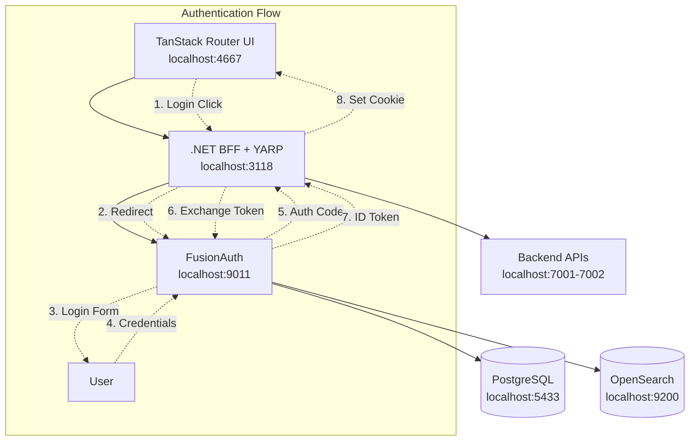

# FusionAuth + .NET BFF Authentication Setup

This project implements a **Backend for Frontend (BFF)** authentication pattern using FusionAuth as the Identity Provider (IDP) and ASP.NET Core as the BFF with YARP reverse proxy. This provides secure session management with CSRF protection for a TanStack Router frontend application.

## Architecture Overview



## 🚀 Quick Start

### Prerequisites
- Docker & Docker Compose
- .NET 9.0 SDK
- Node.js (18+) & pnpm

### 1. Start FusionAuth Infrastructure

```bash
# Start FusionAuth, PostgreSQL, and OpenSearch
docker compose up -d

# Run setup script (idempotent)
./setup-fusionauth.sh
```

### 2. Start the BFF

```bash
cd BespokeBff
dotnet run
```

### 3. Start the React UI

```bash
cd Ui/example-ui
pnpm dev
```

### 4. Test Authentication

Visit http://localhost:4667 and click "Login" to test the flow.

## 🔐 How Authentication Works

### BFF Pattern Benefits

The Backend for Frontend (BFF) pattern provides several security advantages:

- **Secure Token Storage**: Tokens are stored server-side, not in browser
- **Enhanced Session Management**: Uses secure HTTP-only cookies with `__Host-` prefix
- **CSRF Protection**: X-CSRF header validation for state-changing requests
- **CORS Protection**: Strict origin validation with credential requirements
- **Token Refresh**: Automatic token refresh with Duende AccessTokenManagement
- **API Proxying**: YARP reverse proxy for seamless backend API integration

### Authentication Flow

#### Login Flow

1. **User clicks Login** → UI calls `/auth/login` on BFF
2. **BFF redirects** → User sent to FusionAuth login page
3. **User authenticates** → Enters credentials on FusionAuth
4. **Authorization code** → FusionAuth redirects back with auth code
5. **Token exchange** → BFF exchanges code for ID/access tokens
6. **Session creation** → BFF creates secure session cookie
7. **User redirected** → Back to UI, now authenticated

#### API Calls

1. **UI makes request** → With session cookie to BFF endpoint
2. **BFF validates session** → Checks cookie and user state
3. **Token attached** → BFF adds bearer token to downstream API calls
4. **Response returned** → BFF returns data to UI

#### Logout Flow

1. **User clicks Logout** → UI calls `/auth/logout` on BFF
2. **BFF initiates logout** → Redirects to FusionAuth logout endpoint
3. **Session cleanup** → FusionAuth and BFF clear sessions
4. **User redirected** → Back to UI, now logged out

## 📡 BFF API Endpoints

### Authentication Endpoints

| Endpoint | Method | Description |
|----------|--------|-------------|
| `/bff/login` | GET | Initiates OIDC login flow |
| `/bff/logout` | GET | Initiates logout flow |
| `/bff/user` | GET | Returns current user info & claims |
| `/bff/status` | GET | Returns authentication status |
| `/bff/refresh` | POST | Refreshes access token (CSRF protected) |
| `/health` | GET | Health check endpoint |

### API Proxy Endpoints

| Endpoint | Method | Description |
|----------|--------|-------------|
| `/api/{**catch-all}` | ALL | Proxies to backend API (localhost:7001) |
| `/auth-api/{**catch-all}` | ALL | Proxies to auth API (localhost:7002) |

### Example Responses

#### `/bff/status` (Unauthenticated)
```json
{
  "isAuthenticated": false,
  "name": null
}
```

#### `/bff/user` (Authenticated)
```json
{
  "isAuthenticated": true,
  "name": "Test User",
  "email": "test@example.local",
  "claims": [
    {
      "type": "sub",
      "value": "3bbd5835-4444-4761-8a65-7bc53c427d2e"
    },
    {
      "type": "email",
      "value": "test@example.local"
    }
  ]
}
```

## 🛠 Configuration

### FusionAuth Application Settings

The setup script configures FusionAuth with these settings:

```json
{
  "name": "MyApp BFF",
  "clientId": "fd123988-b649-4c44-afff-987ef6bd66a6",
  "clientSecret": "super-secret-client-secret-new",
  "authorizedRedirectURLs": [
    "http://localhost:3118/signin-oidc",
    "https://localhost:3118/signin-oidc",
    "http://localhost:3118/signout-callback-oidc",
    "http://localhost:4667/",
    "http://localhost:4667"
  ],
  "authorizedOriginURLs": [
    "http://localhost:3118",
    "https://localhost:3118", 
    "http://localhost:4667",
    "https://localhost:4667"
  ],
  "enabledGrants": [
    "authorization_code",
    "refresh_token"
  ]
}
```

### .NET BFF Configuration

#### appsettings.json
```json
{
  "FusionAuth": {
    "Authority": "http://localhost:9011",
    "ClientId": "fd123988-b649-4c44-afff-987ef6bd66a6",
    "ClientSecret": "super-secret-client-secret-new",
    "Audience": "fd123988-b649-4c44-afff-987ef6bd66a6"
  }
}
```

#### Program.cs Key Features

```csharp
// OIDC Configuration
services.AddAuthentication(options =>
{
    options.DefaultScheme = CookieAuthenticationDefaults.AuthenticationScheme;
    options.DefaultChallengeScheme = OpenIdConnectDefaults.AuthenticationScheme;
})
.AddCookie(options =>
{
    options.Cookie.Name = "__Host-MyAppBFF";
    options.Cookie.SecurePolicy = CookieSecurePolicy.Always;
    options.Cookie.SameSite = SameSiteMode.Strict;
    options.Cookie.HttpOnly = true;
    options.ExpireTimeSpan = TimeSpan.FromHours(1);
    options.SlidingExpiration = true;
})
.AddOpenIdConnect(options =>
{
    // FusionAuth configuration
    options.Authority = fusionAuthConfig["Authority"];
    options.ClientId = fusionAuthConfig["ClientId"];
    options.ClientSecret = fusionAuthConfig["ClientSecret"];
    
    // Enhanced token management and logout handling
    options.Scope.Add("offline_access"); // Required for refresh tokens
    options.SaveTokens = true;
    options.GetClaimsFromUserInfoEndpoint = true;
    options.UsePkce = true;
    
    options.Events = new OpenIdConnectEvents
    {
        OnRedirectToIdentityProviderForSignOut = context =>
        {
            var logoutUri = $"http://localhost:9011/oauth2/logout?client_id={context.Options.ClientId}";
            // Handle post-logout redirect URI with proper encoding
            if (!string.IsNullOrEmpty(context.Properties.RedirectUri)) {
                logoutUri += $"&post_logout_redirect_uri={Uri.EscapeDataString(context.Properties.RedirectUri)}";
            }
            context.Response.Redirect(logoutUri);
            context.HandleResponse();
            return Task.CompletedTask;
        }
    };
});

// Add Duende Access Token Management for automatic token refresh
services.AddMemoryCache();
services.AddDistributedMemoryCache();
services.AddOpenIdConnectAccessTokenManagement(options =>
{
    options.RefreshBeforeExpiration = TimeSpan.FromMinutes(5);
    options.UseChallengeSchemeScopedTokens = true;
});

// Add YARP reverse proxy with authentication header transform
services.AddReverseProxy()
    .LoadFromConfig(Configuration.GetSection("ReverseProxy"))
    .AddTransforms<AuthHeaderTransform>();

// Add CSRF protection middleware
services.AddCsrfProtection(options =>
{
    options.HeaderName = "X-CSRF";
    options.RequiredHeaderValue = "1";
});
```

### TanStack Router UI Integration

#### Authentication Hook
```typescript
// src/hooks/use-auth.ts
export function useAuth() {
  const [user, setUser] = useState<User | null>(null)
  const [loading, setLoading] = useState(true)

  const checkAuth = async () => {
    const userData = await getCurrentUser()
    setUser(userData)
  }

  useEffect(() => {
    checkAuth()
  }, [])

  return {
    user,
    loading,
    isAuthenticated: user?.isAuthenticated ?? false,
    refetch: checkAuth,
  }
}
```

#### API Client with CSRF Protection
```typescript
// src/lib/api.ts - Enhanced with CSRF protection
const BFF_BASE_URL = 'http://localhost:3118'
const CSRF_HEADER_NAME = 'X-CSRF'
const CSRF_HEADER_VALUE = '1'

export async function getCurrentUser(): Promise<User | null> {
  const response = await fetch(`${BFF_BASE_URL}/bff/user`, {
    credentials: 'include',
    headers: { 'Content-Type': 'application/json' }
  })
  
  return response.ok ? await response.json() : null
}

export function login(returnUrl?: string) {
  const url = new URL(`${BFF_BASE_URL}/bff/login`)
  if (returnUrl) url.searchParams.set('returnUrl', returnUrl)
  window.location.href = url.toString()
}

// CSRF-protected POST requests
export async function bffPost<T>(url: string, data?: any): Promise<T> {
  const response = await fetch(`${BFF_BASE_URL}${url}`, {
    method: 'POST',
    credentials: 'include',
    headers: {
      'Content-Type': 'application/json',
      [CSRF_HEADER_NAME]: CSRF_HEADER_VALUE
    },
    body: data ? JSON.stringify(data) : undefined
  })
  
  if (!response.ok) throw new Error(`HTTP ${response.status}`)
  return response.json()
}
```

## 🔧 Development

### Default Credentials

- **FusionAuth Admin**: http://localhost:9011/admin
- **Test User**: `test@example.local` / `password`

### Ports

| Service | Port | Description |
|---------|------|-------------|
| TanStack Router UI | 4667 | Frontend application |
| .NET BFF + YARP | 3118 | Backend for Frontend with reverse proxy |
| Backend API | 7001 | Main backend API (proxied via /api/*) |
| Auth API | 7002 | Authentication API (proxied via /auth-api/*) |
| FusionAuth | 9011 | Identity provider |
| PostgreSQL | 5433 | FusionAuth database |
| OpenSearch | 9200 | FusionAuth search engine |

### Docker Services

```bash
# View running services
docker compose ps

# View logs
docker compose logs fusionauth
docker compose logs db

# Restart services
docker compose restart fusionauth

# Clean restart
docker compose down && docker compose up -d
```

## 🛡 Security Considerations

### Production Checklist

- [ ] Use HTTPS everywhere
- [ ] Set `RequireHttpsMetadata = true` in OIDC config
- [ ] Configure proper CORS origins
- [ ] Use secure cookie settings (`Secure`, `HttpOnly`, `SameSite`)
- [ ] Set up proper certificate validation
- [ ] Use strong client secrets
- [ ] Configure session timeouts appropriately
- [ ] Implement proper error handling
- [ ] Add rate limiting
- [ ] Set up monitoring and logging

### Environment Variables

For production, use environment variables instead of hardcoded values:

```bash
export FUSIONAUTH_AUTHORITY="https://auth.yourdomain.com"
export FUSIONAUTH_CLIENT_ID="your-client-id"
export FUSIONAUTH_CLIENT_SECRET="your-client-secret"
```

## 🚨 Troubleshooting

### Common Issues

#### "Invalid redirect_uri" Error
- Verify redirect URLs are configured in FusionAuth application
- Check that URLs match exactly (including trailing slashes)

#### CORS Errors
- Ensure BFF CORS policy includes UI origin
- Verify credentials are being sent with requests

#### Session Not Persisting
- Check cookie domain and path settings
- Verify `SameSite` policy is appropriate
- Ensure HTTPS is used in production

#### Logout Not Working
- Verify post-logout redirect URIs are configured
- Check FusionAuth logout URL configuration
- Ensure custom logout event handler is working

### Debug Tools

```bash
# Check FusionAuth application config
curl -H "Authorization: bf69486b-4733-4470-a592-f1bfce7af580" \
  http://localhost:9011/api/application/fd123988-b649-4c44-afff-987ef6bd66a6

# Test BFF endpoints
curl -i http://localhost:3118/bff/status
curl -i http://localhost:3118/health

# Test CSRF protection (should return 400 without header)
curl -i -X POST -b "__Host-MyAppBFF=your-session-cookie" http://localhost:3118/bff/refresh

# Test with CSRF header (should work)
curl -i -X POST -H "X-CSRF: 1" -b "__Host-MyAppBFF=your-session-cookie" http://localhost:3118/bff/refresh

# View container logs
docker compose logs -f fusionauth
```

## 📚 Additional Resources

- [FusionAuth Documentation](https://fusionauth.io/docs/)
- [ASP.NET Core Authentication](https://docs.microsoft.com/en-us/aspnet/core/security/authentication/)
- [OpenID Connect Specification](https://openid.net/connect/)
- [BFF Pattern](https://datatracker.ietf.org/doc/html/draft-ietf-oauth-browser-based-apps-19)