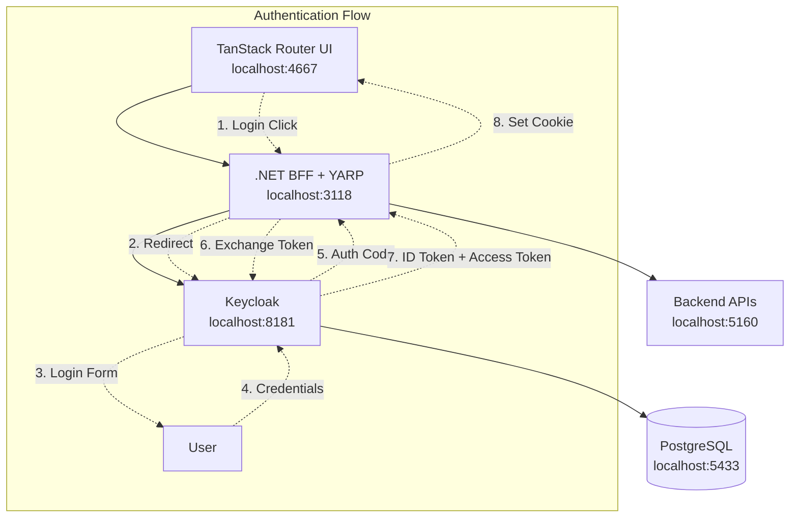

# Keycloak + .NET BFF Authentication Setup

This project implements a **Backend for Frontend (BFF)** authentication pattern using Keycloak as the Identity Provider (IDP) and ASP.NET Core as the BFF with YARP reverse proxy. This provides secure session management with CSRF protection for a TanStack Router frontend application.

## Architecture Overview



## 🚀 Quick Start

### Prerequisites
- Docker & Docker Compose
- .NET 9.0 SDK
- Node.js (18+) & pnpm
- Pulumi CLI

### 1. Start Keycloak Infrastructure

```bash
# Start Keycloak and PostgreSQL
docker compose up -d

# Wait for Keycloak to be ready (can take 30-60 seconds)
docker compose logs -f keycloak
# Look for: "Keycloak 26.0 started"
```

### 2. Configure Keycloak with Pulumi

```bash
cd BespokeIdp

# Install dependencies
dotnet restore

# Login to Pulumi (local backend)
pulumi login --local

# Set Keycloak credentials (same as in .env)
pulumi config set keycloak:username admin --secret
pulumi config set keycloak:password admin --secret

# Deploy Keycloak configuration
pulumi up
```

This will configure:
- **Realm**: BespokeBff
- **Custom Scope/Audience**: `bespoke_bff_api`
- **Clients**: `bespoke_bff` (Authorization Code + PKCE), `bespoke_api_machine` (Client Credentials)
- **Users**: admin@example.local, test@example.local

### 3. Start the BFF

```bash
cd ../BespokeBff
dotnet run
```

### 4. Start the React UI

```bash
cd Ui/example-ui
pnpm dev
```

### 5. Test Authentication

Visit http://localhost:4667 and click "Login" to test the flow.

## 🔐 How Authentication Works

### BFF Pattern Benefits

The Backend for Frontend (BFF) pattern provides several security advantages:

- **Secure Token Storage**: Tokens are stored server-side, not in browser
- **Enhanced Session Management**: Uses secure HTTP-only cookies with `__Host-` prefix
- **CSRF Protection**: X-CSRF header validation for state-changing requests
- **CORS Protection**: Strict origin validation with credential requirements
- **Token Refresh**: Automatic token refresh with Duende AccessTokenManagement
- **API Proxying**: YARP reverse proxy for seamless backend API integration
- **Proper Audience Validation**: Keycloak supports custom audiences natively

### Authentication Flow

#### Login Flow

1. **User clicks Login** → UI calls `/bff/login` on BFF
2. **BFF redirects** → User sent to Keycloak login page
3. **User authenticates** → Enters credentials on Keycloak
4. **Authorization code** → Keycloak redirects back with auth code
5. **Token exchange** → BFF exchanges code for ID/access tokens
6. **Session creation** → BFF creates secure session cookie
7. **User redirected** → Back to UI, now authenticated

#### API Calls

1. **UI makes request** → With session cookie to BFF endpoint
2. **BFF validates session** → Checks cookie and user state
3. **Token attached** → BFF adds bearer token to downstream API calls
4. **API validates token** → Checks JWT signature, issuer, audience, lifetime
5. **Response returned** → BFF returns data to UI

#### Logout Flow

1. **User clicks Logout** → UI calls `/bff/logout` on BFF
2. **BFF initiates logout** → Redirects to Keycloak logout endpoint
3. **Session cleanup** → Keycloak and BFF clear sessions
4. **User redirected** → Back to UI, now logged out

## 📡 BFF API Endpoints

### Authentication Endpoints

| Endpoint | Method | Description |
|----------|--------|-------------|
| `/bff/login` | GET | Initiates OIDC login flow |
| `/bff/logout` | GET | Initiates logout flow |
| `/bff/user` | GET | Returns current user info & claims |
| `/bff/status` | GET | Returns authentication status |
| `/bff/refresh` | POST | Refreshes access token (CSRF protected) |
| `/health` | GET | Health check endpoint |

### API Proxy Endpoints

| Endpoint | Method | Description |
|----------|--------|-------------|
| `/api/{**catch-all}` | ALL | Proxies to backend API (localhost:5160) |

### Example Responses

#### `/bff/status` (Unauthenticated)
```json
{
  "isAuthenticated": false,
  "name": null
}
```

#### `/bff/user` (Authenticated)
```json
{
  "isAuthenticated": true,
  "name": "Test User",
  "email": "test@example.local",
  "claims": [
    {
      "type": "sub",
      "value": "3bbd5835-4444-4761-8a65-7bc53c427d2e"
    },
    {
      "type": "email",
      "value": "test@example.local"
    },
    {
      "type": "aud",
      "value": "bespoke_bff_api"
    }
  ]
}
```

## 🛠 Configuration

### Keycloak Configuration (via Pulumi)

See `BespokeIdp/RealmBuild.cs` for the complete Keycloak configuration.

Key configuration includes:
- **Realm**: BespokeBff
- **Client ID**: `bespoke_bff`
- **Client Secret**: `2274075d-3358-4f59-a13a-ddf4c6906b1e`
- **Audience**: `bespoke_bff_api` (custom scope with audience mapper)
- **Redirect URIs**: http://localhost:3118/*, http://localhost:4667/*
- **PKCE**: Required (S256)
- **Grant Types**: authorization_code, refresh_token

### .NET BFF Configuration

#### appsettings.Development.json
```json
{
  "Keycloak": {
    "Authority": "http://localhost:8181/realms/BespokeBff",
    "ClientId": "bespoke_bff",
    "ClientSecret": "2274075d-3358-4f59-a13a-ddf4c6906b1e",
    "Audience": "bespoke_bff_api"
  },
  "Cors": {
    "AllowedOrigins": [
      "http://localhost:4667",
      "https://localhost:4667"
    ]
  }
}
```

### Test API Configuration

#### appsettings.json
```json
{
  "Keycloak": {
    "Authority": "http://localhost:8181/realms/BespokeBff",
    "ValidAudience": "bespoke_bff_api"
  }
}
```

The Test API validates JWT tokens with proper audience validation:
- **Issuer**: http://localhost:8181/realms/BespokeBff
- **Audience**: bespoke_bff_api
- **Signature**: Validated via JWKS from Keycloak

Unlike FusionAuth free tier, Keycloak supports custom audiences natively, so no complex workarounds are needed!

### TanStack Router UI Integration

#### Authentication Hook
```typescript
// src/hooks/use-auth.ts
export function useAuth() {
  const [user, setUser] = useState<User | null>(null)
  const [loading, setLoading] = useState(true)

  const checkAuth = async () => {
    const userData = await getCurrentUser()
    setUser(userData)
  }

  useEffect(() => {
    checkAuth()
  }, [])

  return {
    user,
    loading,
    isAuthenticated: user?.isAuthenticated ?? false,
    refetch: checkAuth,
  }
}
```

#### API Client with CSRF Protection
```typescript
// src/lib/api.ts - Enhanced with CSRF protection
const BFF_BASE_URL = 'http://localhost:3118'
const CSRF_HEADER_NAME = 'X-CSRF'
const CSRF_HEADER_VALUE = '1'

export async function getCurrentUser(): Promise<User | null> {
  const response = await fetch(`${BFF_BASE_URL}/bff/user`, {
    credentials: 'include',
    headers: { 'Content-Type': 'application/json' }
  })

  return response.ok ? await response.json() : null
}

export function login(returnUrl?: string) {
  const url = new URL(`${BFF_BASE_URL}/bff/login`)
  if (returnUrl) url.searchParams.set('returnUrl', returnUrl)
  window.location.href = url.toString()
}

// CSRF-protected POST requests
export async function bffPost<T>(url: string, data?: any): Promise<T> {
  const response = await fetch(`${BFF_BASE_URL}${url}`, {
    method: 'POST',
    credentials: 'include',
    headers: {
      'Content-Type': 'application/json',
      [CSRF_HEADER_NAME]: CSRF_HEADER_VALUE
    },
    body: data ? JSON.stringify(data) : undefined
  })

  if (!response.ok) throw new Error(`HTTP ${response.status}`)
  return response.json()
}
```

## 🔧 Development

### Default Credentials

- **Keycloak Admin Console**: http://localhost:8181/admin (admin / admin)
- **Test User**: `test@example.local` / `password`
- **Admin User**: `admin@example.local` / `password123`

### Ports

| Service | Port | Description |
|---------|------|-------------|
| TanStack Router UI | 4667 | Frontend application |
| .NET BFF + YARP | 3118 | Backend for Frontend with reverse proxy |
| Test API | 5160 | Test backend API (proxied via /api/*) |
| Keycloak | 8181 | Identity provider |
| PostgreSQL | 5433 | Keycloak database |

### Docker Services

```bash
# View running services
docker compose ps

# View logs
docker compose logs keycloak
docker compose logs db

# Restart services
docker compose restart keycloak

# Clean restart
docker compose down && docker compose up -d
```

### Updating Keycloak Configuration

After making changes to `BespokeIdp/RealmBuild.cs`:

```bash
cd BespokeIdp
pulumi up
```

Pulumi will show you a preview of changes before applying them.

## 🛡 Security Considerations

### Production Checklist

- [ ] Use HTTPS everywhere
- [ ] Set `RequireHttpsMetadata = true` in OIDC config
- [ ] Configure proper CORS origins
- [ ] Use secure cookie settings (`Secure`, `HttpOnly`, `SameSite`)
- [ ] Set up proper certificate validation
- [ ] Use strong client secrets
- [ ] Configure session timeouts appropriately
- [ ] Implement proper error handling
- [ ] Add rate limiting
- [ ] Set up monitoring and logging
- [ ] Use Keycloak production mode (not dev mode)
- [ ] Configure Keycloak with proper database settings
- [ ] Enable Keycloak security features (brute force protection, etc.)

### Environment Variables

For production, use environment variables instead of hardcoded values:

```bash
export KEYCLOAK_AUTHORITY="https://auth.yourdomain.com/realms/BespokeBff"
export KEYCLOAK_CLIENT_ID="your-client-id"
export KEYCLOAK_CLIENT_SECRET="your-client-secret"
```

## 🚨 Troubleshooting

### Common Issues

#### "Invalid redirect_uri" Error
- Verify redirect URLs are configured in Keycloak client (via Pulumi)
- Check that URLs match exactly (including trailing slashes)
- Run `pulumi up` to ensure configuration is deployed

#### CORS Errors
- Ensure BFF CORS policy includes UI origin
- Verify credentials are being sent with requests
- Check Keycloak client web origins configuration

#### Session Not Persisting
- Check cookie domain and path settings
- Verify `SameSite` policy is appropriate
- Ensure HTTPS is used in production

#### Keycloak Not Starting
- Check if port 8181 is already in use
- Verify PostgreSQL is healthy: `docker compose ps`
- Check logs: `docker compose logs keycloak`

#### Pulumi Deployment Fails
- Ensure Keycloak is running and healthy
- Verify admin credentials are correct
- Check Pulumi config: `pulumi config`

### Debug Tools

```bash
# Check Keycloak health
curl http://localhost:8181/health/ready

# Test BFF endpoints
curl -i http://localhost:3118/bff/status
curl -i http://localhost:3118/health

# Test CSRF protection (should return 400 without header)
curl -i -X POST -b "__Host-MyAppBFF=your-session-cookie" http://localhost:3118/bff/refresh

# Test with CSRF header (should work)
curl -i -X POST -H "X-CSRF: 1" -b "__Host-MyAppBFF=your-session-cookie" http://localhost:3118/bff/refresh

# View container logs
docker compose logs -f keycloak

# Access Keycloak admin console
open http://localhost:8181/admin
```

## 📚 Additional Resources

- [Keycloak Documentation](https://www.keycloak.org/documentation)
- [Pulumi Keycloak Provider](https://www.pulumi.com/registry/packages/keycloak/)
- [ASP.NET Core Authentication](https://docs.microsoft.com/en-us/aspnet/core/security/authentication/)
- [OpenID Connect Specification](https://openid.net/connect/)
- [BFF Pattern](https://datatracker.ietf.org/doc/html/draft-ietf-oauth-browser-based-apps-19)

## 🔄 Migration from FusionAuth

This project was migrated from FusionAuth to Keycloak. Key improvements:

1. **Native Custom Audience Support**: No more complex workarounds for audience validation
2. **Simplified JWT Validation**: Standard OIDC claims work out of the box
3. **Infrastructure as Code**: Pulumi-based configuration instead of manual kickstart files
4. **Better Production Support**: Keycloak has robust production features and scaling options
5. **Open Source**: Fully open source with no paid-tier limitations

For migration details, see the commit history on the `keycloak` branch.
