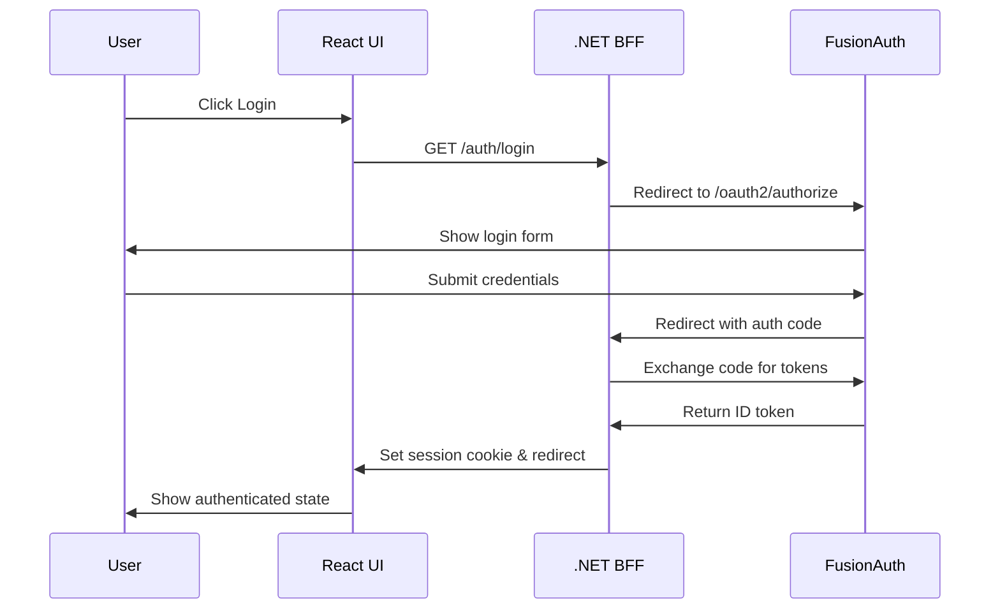

# Authentication Integration Guide

This document explains how the React frontend integrates with the FusionAuth + .NET BFF authentication system.

## Overview

The frontend uses a **Backend for Frontend (BFF)** authentication pattern where:
- Authentication tokens are stored server-side in the BFF
- Frontend communicates with BFF using secure HTTP-only cookies  
- BFF handles all OIDC flows and token management
- Frontend makes simple HTTP calls to BFF endpoints

## Authentication Flow



## Frontend Implementation

### Authentication Hook

The `useAuth` hook provides reactive authentication state:

```typescript
// src/hooks/use-auth.ts
import { useAuth } from '~/hooks/use-auth'

function MyComponent() {
  const { user, loading, isAuthenticated, refetch } = useAuth()
  
  if (loading) return <div>Loading...</div>
  if (!isAuthenticated) return <div>Please log in</div>
  
  return <div>Welcome, {user.name}!</div>
}
```

#### Hook API

| Property | Type | Description |
|----------|------|-------------|
| `user` | `User \| null` | Current user data and claims |
| `loading` | `boolean` | Whether auth check is in progress |
| `isAuthenticated` | `boolean` | Whether user is logged in |
| `error` | `string \| null` | Any authentication errors |
| `refetch` | `() => Promise<void>` | Manually refresh auth state |

### Authentication Components

#### AuthButton Component

Renders login/logout button based on auth state:

```typescript
// src/components/auth-button.tsx
import { AuthButton } from '~/components/auth-button'

function Header() {
  return (
    <nav>
      <h1>My App</h1>
      <AuthButton />
    </nav>
  )
}
```

#### UserInfo Component

Displays user information and claims:

```typescript
// src/components/user-info.tsx
import { UserInfo } from '~/components/user-info'

function Dashboard() {
  return (
    <div>
      <h2>Dashboard</h2>
      <UserInfo />
    </div>
  )
}
```

### Authentication Utilities

The auth utilities handle communication with the BFF:

```typescript
// src/lib/auth.ts
import { login, logout, getCurrentUser, getAuthStatus } from '~/lib/auth'

// Trigger login flow
login(window.location.href) // Redirect back after login

// Trigger logout flow  
logout('/') // Redirect to home after logout

// Check current auth status (lightweight)
const status = await getAuthStatus() // { isAuthenticated: boolean, name?: string }

// Get full user data with claims
const user = await getCurrentUser() // Full user object or null
```

### API Configuration

All API calls use the enhanced `api.ts` utilities that automatically handle:
- Session cookies via `credentials: 'include'`  
- CSRF protection via `X-CSRF: 1` header for state-changing requests
- Proper error handling and type safety

```typescript
// src/lib/api.ts - Enhanced fetch with CSRF protection
import { bffGet, bffPost, bffPut, bffDelete } from '~/lib/api'

// GET request (no CSRF header needed)
const user = await bffGet<User>('/bff/user')

// POST request (automatically includes X-CSRF: 1 header)
const result = await bffPost<RefreshResult>('/bff/refresh')

// PUT/PATCH/DELETE also automatically include CSRF headers
const updated = await bffPut<User>('/bff/user', userData)
```

#### Manual Fetch with CSRF
For custom requests, use the `apiFetch` wrapper:

```typescript
import { apiFetch } from '~/lib/api'

const response = await apiFetch('/bff/custom-endpoint', {
  method: 'POST',
  body: JSON.stringify({ data: 'example' })
})
// X-CSRF: 1 header automatically added for POST requests
```

## State Management

### Authentication State

The authentication state is managed at the component level using React hooks:

```typescript
interface User {
  isAuthenticated: boolean
  name?: string
  email?: string
  claims?: Array<{
    type: string
    value: string
  }>
}

interface AuthStatus {
  isAuthenticated: boolean
  name?: string
}
```

### State Updates

Authentication state updates in these scenarios:

1. **Initial page load**: `useAuth` hook checks auth status
2. **Login completion**: User redirected back from FusionAuth  
3. **Logout completion**: User redirected back from logout
4. **Manual refresh**: Calling `refetch()` function
5. **Session expiry**: API calls return 401, triggering re-check

### Handling Route Protection

Protect routes by checking authentication state:

```typescript
// src/routes/protected.tsx
import { createFileRoute, redirect } from '@tanstack/react-router'
import { getAuthStatus } from '~/lib/auth'

export const Route = createFileRoute('/protected')({
  beforeLoad: async () => {
    const status = await getAuthStatus()
    if (!status.isAuthenticated) {
      throw redirect({
        to: '/',
        search: {
          redirect: '/protected'
        }
      })
    }
  },
  component: ProtectedComponent
})
```

## Error Handling

### Authentication Errors

Handle authentication errors gracefully:

```typescript
export function useAuth() {
  const [error, setError] = useState<string | null>(null)

  const checkAuth = async () => {
    try {
      setLoading(true)
      setError(null)
      const userData = await getCurrentUser()
      setUser(userData)
    } catch (err) {
      setError('Failed to check authentication')
      setUser({ isAuthenticated: false })
    } finally {
      setLoading(false)
    }
  }

  return { user, loading, error, isAuthenticated, refetch: checkAuth }
}
```

### Network Errors

Handle network errors when calling BFF endpoints:

```typescript
export async function getAuthStatus(): Promise<AuthStatus> {
  try {
    const response = await fetch(`${BFF_BASE_URL}/auth/status`, {
      credentials: 'include',
      headers: { 'Content-Type': 'application/json' }
    })

    return response.ok 
      ? await response.json()
      : { isAuthenticated: false }
      
  } catch (error) {
    console.error('Auth status check failed:', error)
    return { isAuthenticated: false }
  }
}
```

## Development Setup

### Environment Configuration

The frontend is configured to work with local development:

```typescript
// src/lib/auth.ts
const BFF_BASE_URL = 'http://localhost:3118' // BFF development server
```

For production, update this to your production BFF URL.

### CORS Configuration

The BFF is configured to accept requests from the UI:

```csharp
// In BFF Program.cs
services.AddCors(options =>
{
    options.AddDefaultPolicy(policy =>
    {
        policy.WithOrigins("http://localhost:4667", "https://localhost:4667")
              .AllowAnyHeader()
              .AllowAnyMethod()
              .AllowCredentials(); // ← Required for cookies
    });
});
```

## Testing Authentication

### Manual Testing

1. **Start services**:
   ```bash
   # Terminal 1: Start BFF
   cd BespokeBff && dotnet run
   
   # Terminal 2: Start UI  
   cd example-ui && pnpm dev
   ```

2. **Test flow**:
   - Visit http://localhost:4667
   - Click "Login" → Should redirect to FusionAuth
   - Login with `test@example.local` / `password`
   - Should redirect back authenticated
   - Click "Logout" → Should clear session

### Debug Authentication

Use browser developer tools to inspect:

1. **Network tab**: Check API calls to `/auth/*` endpoints
2. **Application tab**: View cookies (should see `ExampleBFF` cookie)
3. **Console**: Check for authentication errors

### API Testing

Test BFF endpoints directly:

```bash
# Check auth status
curl -i -b cookies.txt http://localhost:3118/auth/status

# Get user info (requires authentication)  
curl -i -b cookies.txt http://localhost:3118/auth/user

# Health check
curl -i http://localhost:3118/health
```

## CSRF Protection

The frontend automatically includes CSRF protection for all state-changing requests (POST, PUT, PATCH, DELETE).

### How It Works

1. **Automatic Header Injection**: The `apiFetch` utility automatically adds `X-CSRF: 1` header to state-changing requests
2. **Backend Validation**: BFF middleware validates the header for authenticated requests  
3. **CORS Pre-flight**: Custom headers trigger CORS pre-flight checks for cross-origin requests
4. **Defense in Depth**: Combined with SameSite cookies for comprehensive CSRF protection

### Testing CSRF Protection

The UI includes a CSRF demo component that lets you test the protection:

1. **Login** to the application
2. **Visit the homepage** to see the CSRF Demo card
3. **Click "Test CSRF Protection"** to send a POST request with proper headers
4. **Success**: Returns a message confirming CSRF headers were accepted
5. **Failure**: Would return 400 Bad Request if headers were missing

### Implementation Details

```typescript
// src/lib/api.ts
const CSRF_HEADER_NAME = 'X-CSRF'
const CSRF_HEADER_VALUE = '1'
const STATEFUL_METHODS = new Set(['POST', 'PUT', 'PATCH', 'DELETE'])

export async function apiFetch(url: string, options: RequestInit = {}) {
  const method = options.method?.toUpperCase() || 'GET'
  const headers = new Headers(options.headers || {})
  
  // Add CSRF header for state-changing requests
  if (STATEFUL_METHODS.has(method)) {
    headers.set(CSRF_HEADER_NAME, CSRF_HEADER_VALUE)
  }
  
  return fetch(url, { ...options, credentials: 'include', headers })
}
```

### Custom API Integration

When integrating with other APIs through the BFF, ensure they also support CSRF protection:

```typescript
// Example: API proxy endpoint that forwards CSRF-protected requests
const apiData = await bffPost('/api/proxy/external-service', {
  action: 'update',
  data: payload
})
```

## Production Considerations

### Security

1. **HTTPS Only**: Configure production to use HTTPS everywhere
2. **Secure Cookies**: Update cookie settings for production
3. **CORS Origins**: Restrict CORS to production domains only
4. **Error Handling**: Don't expose sensitive error details

### Performance

1. **Auth Caching**: Cache auth status checks appropriately
2. **Token Refresh**: Let BFF handle token refresh transparently  
3. **Session Management**: Configure appropriate session timeouts

### Monitoring

1. **Authentication Metrics**: Track login/logout success rates
2. **Session Duration**: Monitor typical session lengths
3. **Error Rates**: Alert on authentication failures

## Troubleshooting

### Common Issues

| Issue | Symptoms | Solution |
|-------|----------|----------|
| CORS errors | Network errors in browser console | Check BFF CORS configuration |
| Session not persisting | User logged out on page refresh | Verify cookies are being set/sent |
| Login redirect fails | Stuck on FusionAuth page | Check redirect URLs in FusionAuth app |
| 401 errors | API calls failing authentication | Check session cookie validity |

### Debug Steps

1. **Check network tab**: Verify API calls are being made
2. **Inspect cookies**: Ensure session cookie is present
3. **Check BFF logs**: Look for authentication errors
4. **Verify FusionAuth config**: Ensure redirect URLs match
5. **Test BFF directly**: Use curl to test endpoints

For more detailed troubleshooting, see the [main README](../BespokeBff/README.md#troubleshooting).