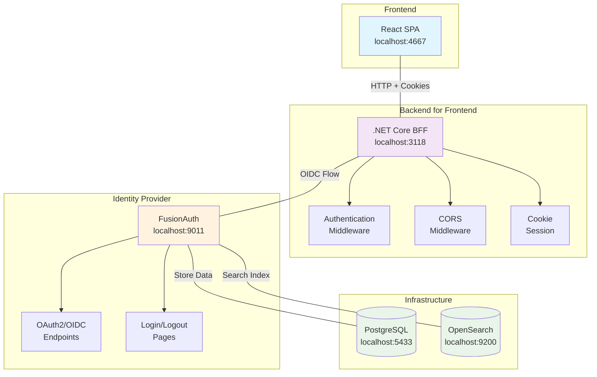
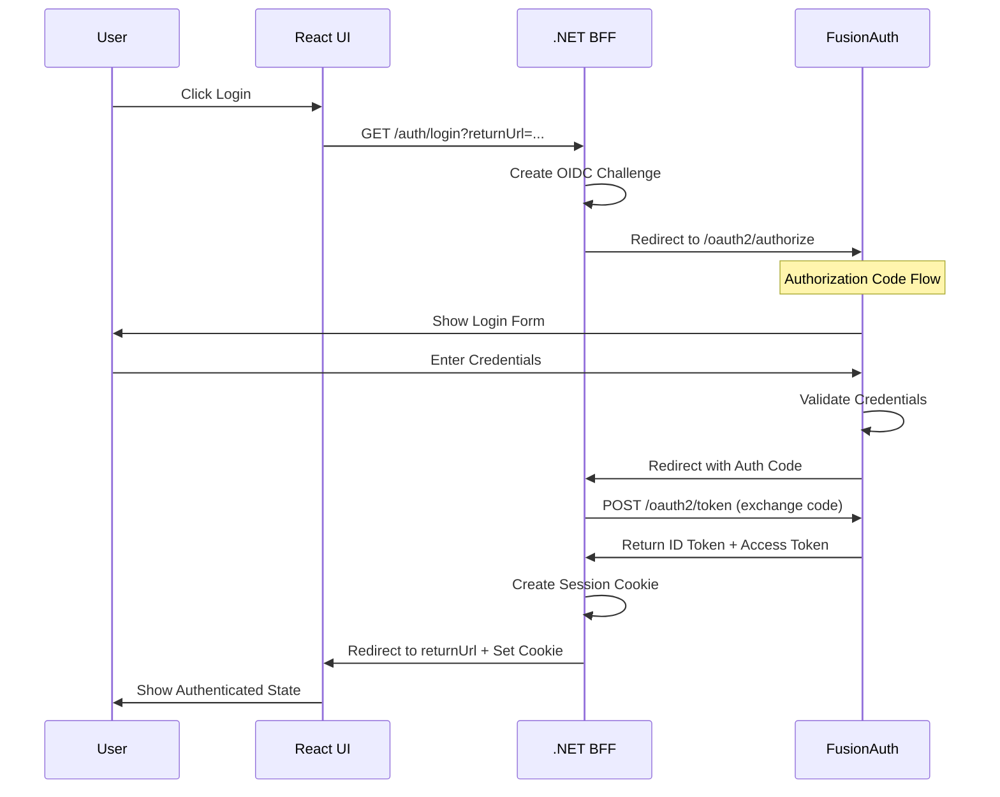
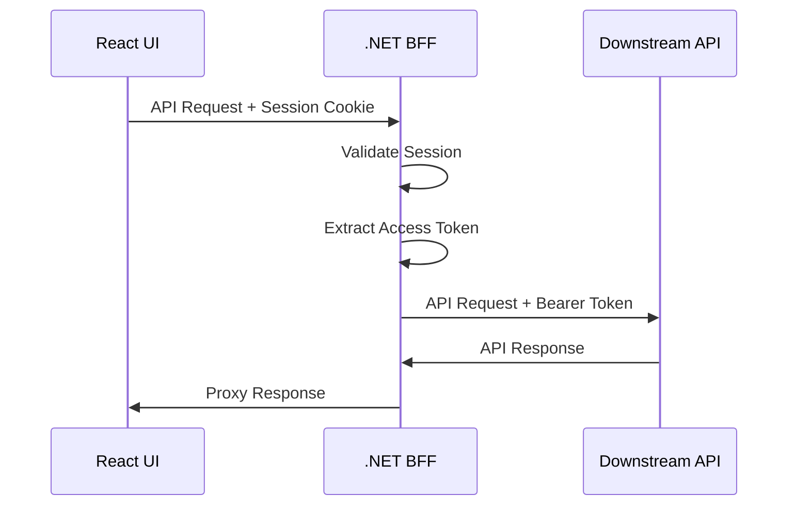
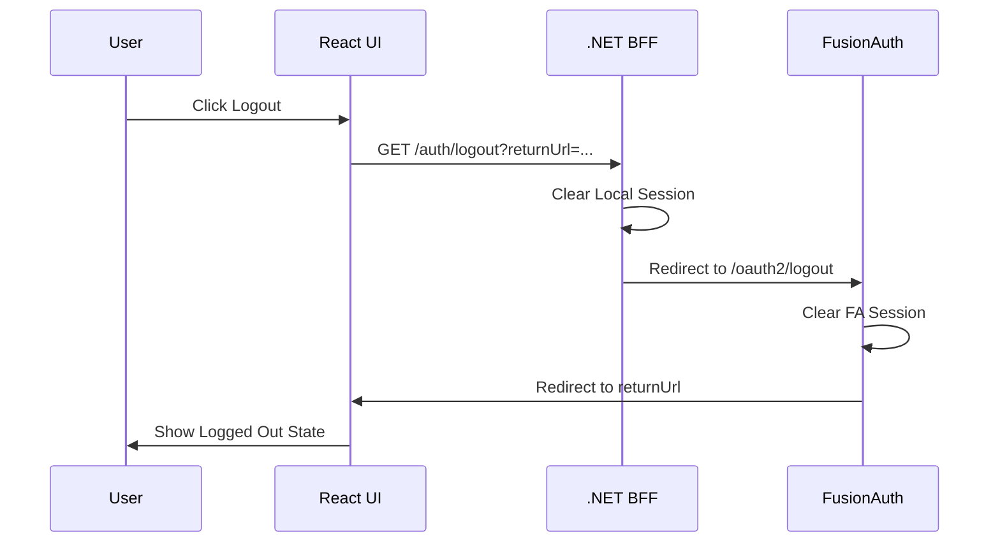

# Authentication Architecture

## Overview

This document describes the authentication architecture using FusionAuth as the Identity Provider (IDP) and ASP.NET Core as a Backend for Frontend (BFF) for a React application.

## Architecture Diagram



## Component Responsibilities

### React Frontend (Port 4667)
- **Purpose**: User interface and experience
- **Authentication**: Session-based via HTTP-only cookies
- **Responsibilities**:
  - Render UI components
  - Handle user interactions
  - Call BFF API endpoints
  - Display authentication state
  - Redirect to login/logout flows

**Key Files:**
- `src/hooks/use-auth.ts` - Authentication state management
- `src/lib/auth.ts` - API communication utilities
- `src/components/auth-button.tsx` - Login/logout UI
- `src/components/user-info.tsx` - User data display

### .NET BFF (Port 3118)
- **Purpose**: Backend for Frontend authentication proxy
- **Authentication**: OIDC client + session management
- **Responsibilities**:
  - Handle OIDC authentication flows
  - Manage user sessions via cookies
  - Proxy authenticated API calls
  - Provide authentication endpoints
  - Handle CORS for frontend

**Key Features:**
```csharp
// Session Management
services.AddAuthentication(options =>
{
    options.DefaultScheme = CookieAuthenticationDefaults.AuthenticationScheme;
    options.DefaultChallengeScheme = OpenIdConnectDefaults.AuthenticationScheme;
})

// OIDC Integration  
.AddOpenIdConnect(options =>
{
    options.Authority = "http://localhost:9011";
    options.ClientId = "fd123988-b649-4c44-afff-987ef6bd66a6";
    options.ClientSecret = "super-secret-client-secret-new";
    options.ResponseType = "code";
    options.GetClaimsFromUserInfoEndpoint = true;
    options.SaveTokens = true;
})

// Cookie Configuration
.AddCookie(options =>
{
    options.Cookie.Name = "MyAppBFF";
    options.Cookie.SameSite = SameSiteMode.Lax;
    options.Cookie.SecurePolicy = CookieSecurePolicy.SameAsRequest;
    options.ExpireTimeSpan = TimeSpan.FromHours(8);
    options.SlidingExpiration = true;
});
```

### FusionAuth IDP (Port 9011)
- **Purpose**: Identity Provider and user management
- **Authentication**: OAuth2/OpenID Connect server
- **Responsibilities**:
  - User authentication and authorization
  - OAuth2/OIDC protocol implementation
  - User management and registration
  - Session management
  - Token issuance and validation

**Configuration:**
- **Application ID**: `fd123988-b649-4c44-afff-987ef6bd66a6`
- **Redirect URIs**: `http://localhost:3118/signin-oidc`
- **Logout URIs**: `http://localhost:3118/signout-callback-oidc`
- **Grants**: `authorization_code`, `refresh_token`

### Infrastructure
- **PostgreSQL (Port 5433)**: FusionAuth data storage
- **OpenSearch (Port 9200)**: FusionAuth search and analytics

## Authentication Flows

### 1. Login Flow



### 2. API Request Flow



### 3. Logout Flow



## Security Model

### Token Storage
- **ID Tokens**: Stored server-side in BFF session
- **Access Tokens**: Stored server-side in BFF session  
- **Refresh Tokens**: Stored server-side in BFF session
- **Session Cookies**: HTTP-only, Secure (in prod), SameSite=Lax

### CORS Policy
```csharp
services.AddCors(options =>
{
    options.AddDefaultPolicy(policy =>
    {
        policy.WithOrigins("http://localhost:4667", "https://localhost:4667")
              .AllowAnyHeader()
              .AllowAnyMethod()  
              .AllowCredentials(); // Required for cookies
    });
});
```

### Session Management
- **Sliding Expiration**: Session extends on activity
- **Absolute Timeout**: 8 hours maximum
- **Cookie Security**: HTTP-only, secure in production
- **CSRF Protection**: SameSite cookie policy

## Data Flow

### Authentication State
```typescript
interface User {
  isAuthenticated: boolean
  name?: string
  email?: string
  claims?: Array<{
    type: string
    value: string
  }>
}
```

### API Endpoints

| Endpoint | Method | Purpose | Response |
|----------|--------|---------|----------|
| `/auth/login` | GET | Initiate login | Redirect to FusionAuth |
| `/auth/logout` | GET | Initiate logout | Redirect to FusionAuth |
| `/auth/user` | GET | Get user info | User object with claims |
| `/auth/status` | GET | Check auth status | Simple auth check |
| `/health` | GET | Health check | Service health |

### Session Cookie Details
- **Name**: `MyAppBFF`
- **Domain**: `localhost` (development)
- **Path**: `/`
- **HttpOnly**: `true`
- **Secure**: `true` (production only)
- **SameSite**: `Lax`

## Deployment Considerations

### Development
- All services run locally on different ports
- HTTP used for simplicity (HTTPS in production)
- Self-signed certificates accepted
- Relaxed CORS policies

### Production
- HTTPS required everywhere
- Proper certificate validation
- Restrictive CORS policies
- Secure cookie settings
- Environment-specific configuration

### Environment Variables
```bash
# Production Configuration
FUSIONAUTH_AUTHORITY=https://auth.yourdomain.com
FUSIONAUTH_CLIENT_ID=prod-client-id
FUSIONAUTH_CLIENT_SECRET=prod-client-secret
FRONTEND_URL=https://app.yourdomain.com
```

## Monitoring and Logging

### BFF Logging
- Authentication events
- Session creation/destruction
- API request patterns
- Error conditions

### FusionAuth Events
- User login/logout
- Failed authentication attempts
- Token exchanges
- Configuration changes

### Metrics to Track
- Authentication success/failure rates
- Session duration patterns
- API endpoint usage
- Error rates by type

## Troubleshooting

### Common Issues

1. **CORS Errors**
   - Check origin configuration
   - Verify credentials are being sent
   - Ensure proper preflight handling

2. **Session Issues**
   - Check cookie configuration
   - Verify session timeout settings
   - Ensure proper domain/path setup

3. **Redirect Errors**
   - Validate redirect URIs in FusionAuth
   - Check for exact URL matches
   - Verify HTTPS/HTTP consistency

4. **Token Issues**
   - Check token expiration
   - Verify client credentials
   - Ensure proper scopes are requested

### Debug Tools

```bash
# Check BFF endpoints
curl -i http://localhost:3118/health
curl -i -b cookies.txt http://localhost:3118/auth/status

# Check FusionAuth config
curl -H "Authorization: api-key" \
  http://localhost:9011/api/application/app-id

# Monitor logs
docker compose logs -f fusionauth
tail -f /var/log/bff/app.log
```

## Future Enhancements

### Potential Improvements
- Token refresh handling
- Multiple authentication providers
- Single sign-on (SSO) integration
- Enhanced session management
- API rate limiting
- Advanced monitoring

### Scalability Considerations
- Session store externalization (Redis)
- Load balancer session affinity
- Horizontal BFF scaling
- Database connection pooling
- Caching strategies